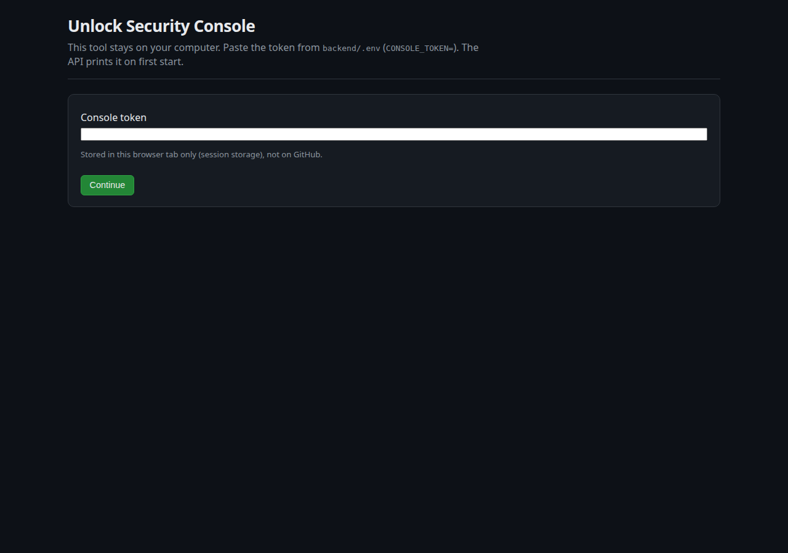
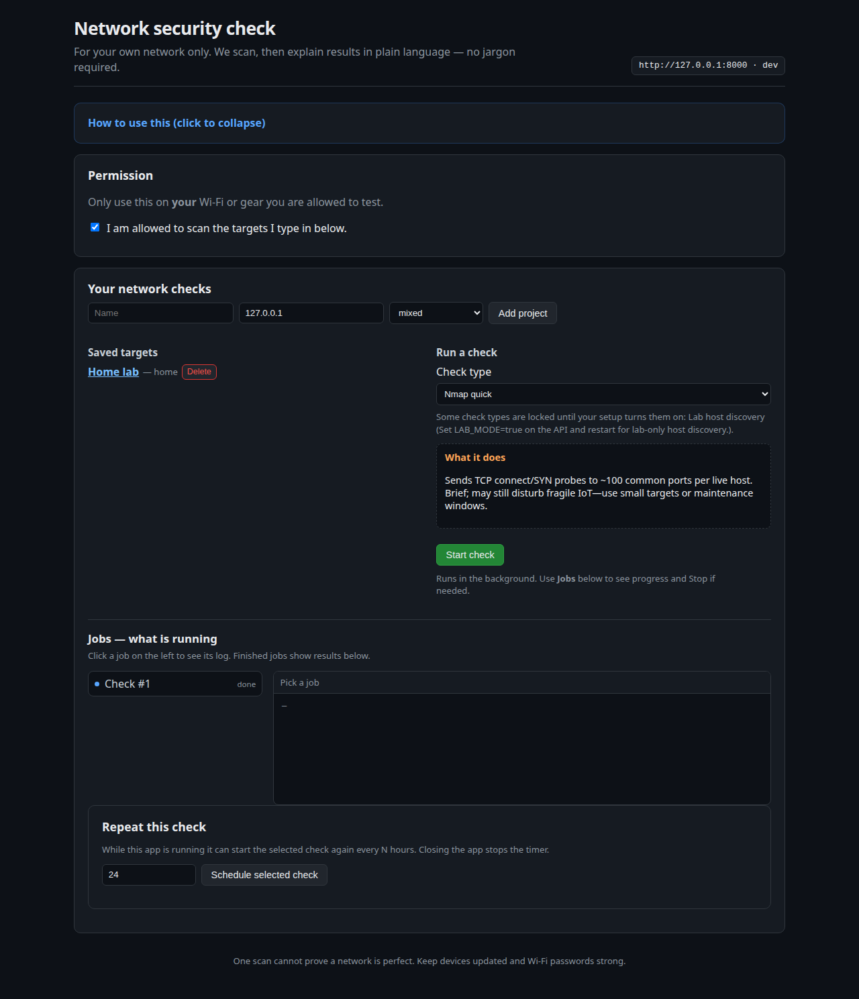
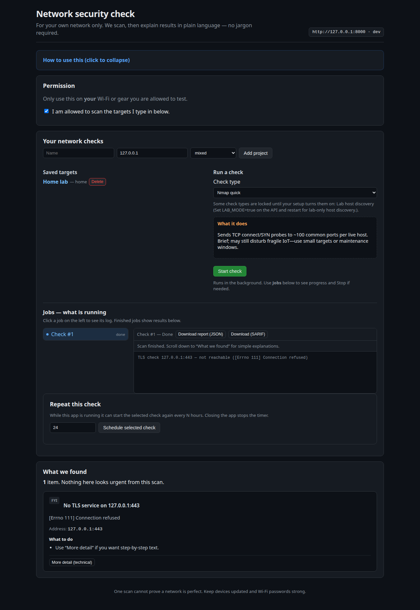

# Security Console

A **local** network security console for systems you own or have written permission to test. It runs on your computer, talks only to `127.0.0.1` by default, and requires a console token before anything else happens.

It is **not** a cloud SOC, not Nessus, and not a tool for scanning the public internet. Wide ranges such as `0.0.0.0/0` are rejected.

**Maintainer contact:** [catflap55.GIT@proton.me](mailto:catflap55.GIT@proton.me)

## What it does

| Check | Purpose |
| --- | --- |
| Nmap quick | Top ports, short run |
| Nmap safe breadth | Top 1000 TCP ports, slower timing |
| TLS certificate check | Protocol version and certificate expiry on 443 |
| HTTP security headers | Missing HSTS/CSP and related headers |
| Lab host discovery | Ping-style inventory when `LAB_MODE=true` |

Results are explained in plain language, exported as JSON or SARIF, and two jobs can be compared. Optional schedules only run **while this app is open**.

Remediation is copy-paste firewall snippets. The console never changes your PC by itself.

## Screenshots

Unlock with the token from `backend/.env` (the field stays empty here on purpose):



Main console after you tick permission and pick a project:



A finished check and the plain-language findings list:



## Legal

Only scan networks you are **authorized** to test. Unauthorized scanning can be illegal. The authors are not responsible for misuse.

## Install (Windows)

1. Install [Python 3.11+](https://www.python.org/downloads/), [Node.js 20+](https://nodejs.org/), and [Nmap](https://nmap.org/download.html).
2. Clone this repository.
3. Double-click `Start-Security-Console.cmd` (or run `.\Start-Security-Console.ps1`).
4. In the API window, copy `CONSOLE_TOKEN` (also saved in `backend/.env`, which is gitignored).
5. Open http://127.0.0.1:5173/ and paste the token.
6. Tick the permission box, add targets such as `127.0.0.1` or `192.168.1.0/24`, run a check.

Stop with `Stop-Security-Console.cmd`.

## Install (macOS / Linux)

```bash
python3 -m pip install -r backend/requirements.txt
npm install
# optional: copy backend/.env.example to backend/.env and set CONSOLE_TOKEN
npm run dev:full
```

Open http://127.0.0.1:5173/ and paste the token printed by the API.

## Configuration

`backend/.env` (never commit this file):

```
CONSOLE_TOKEN=a-long-random-string
NMAP_PATH=/usr/bin/nmap
LAB_MODE=false
ALLOW_NONLOCAL_BIND=false
```

The API refuses to bind off localhost unless `ALLOW_NONLOCAL_BIND=true`. Do not put this console on the public internet.

## Tests

```bash
cd backend
pip install -r requirements.txt
pytest
```

## Security reports

See [SECURITY.md](SECURITY.md). Email **catflap55.GIT@proton.me**. Do not open a public issue with secrets or exploit details.
